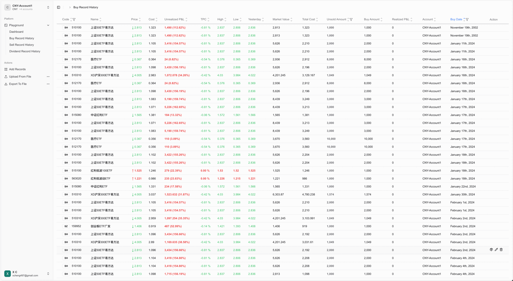

# 996 Trade

[](https://creativecommons.org/licenses/by-nc-sa/4.0/)

Track trades, monitor performance, and analyze profit and loss across stocks, funds, bonds, and more—across multiple accounts and currencies. Supported markets: United States, China, Hong Kong. The stock price refresh interval is 1 second.



## Getting Started

First, run the development server:

```bash
npm install
npm run dev
# or
yarn dev
# or
pnpm dev
# or
bun dev
```

Open [http://localhost:3000](http://localhost:3000) with your browser to see the result.

You can start editing the page by modifying `app/page.tsx`. The page auto-updates as you edit the file.

This project uses [`next/font`](https://nextjs.org/docs/app/building-your-application/optimizing/fonts) to automatically optimize and load [Geist](https://vercel.com/font), a new font family for Vercel.

### Before submitting your code to PR
```
npm run format
```

### Resource

+ [NextAuth.js Authentication With MongoDB](https://www.mongodb.com/developer/languages/typescript/nextauthjs-authentication-mongodb/)
+ [Next-Auth + Mongoose Access to User/Session Models](https://github.com/nextauthjs/next-auth/issues/1175)
+ [Zod to Mongoose schema converter](https://www.npmjs.com/package/@zodyac/zod-mongoose)
+ [Zod Doc](https://zod.dev/)
+ [Cloudflare Worker Next.js](https://developers.cloudflare.com/workers/frameworks/framework-guides/nextjs/)
+ [OpenNext for Cloudflare](https://www.npmjs.com/package/@opennextjs/cloudflare)

## Learn More

To learn more about Next.js, take a look at the following resources:

- [Next.js Documentation](https://nextjs.org/docs) - learn about Next.js features and API.
- [Learn Next.js](https://nextjs.org/learn) - an interactive Next.js tutorial.

You can check out [the Next.js GitHub repository](https://github.com/vercel/next.js) - your feedback and contributions are welcome!

## Deploy on Vercel

The easiest way to deploy your Next.js app is to use the [Vercel Platform](https://vercel.com/new?utm_medium=default-template&filter=next.js&utm_source=create-next-app&utm_campaign=create-next-app-readme) from the creators of Next.js.

Check out our [Next.js deployment documentation](https://nextjs.org/docs/app/building-your-application/deploying) for more details.

https://www.notion.so/xc-6/How-to-Deploy-996-trade-web-app-to-vercel-244559a8f1718051a62dd09fd449b966?source=copy_link

## License

This work is licensed under a [Creative Commons Attribution-NonCommercial-ShareAlike 4.0 International License](http://creativecommons.org/licenses/by-nc-sa/4.0/).

**What this means:**
- ✅ **Personal use** - Use for personal projects and learning
- ✅ **Educational use** - Use in schools, universities, and educational content
- ✅ **Modification** - You can modify and build upon this work
- ✅ **Sharing** - You can redistribute the code
- ❌ **Commercial use** - You cannot use this for commercial purposes
- 📋 **Attribution** - You must give appropriate credit
- 📋 **ShareAlike** - If you modify this work, you must distribute under the same license

For commercial licensing inquiries, please contact the project maintainer.
